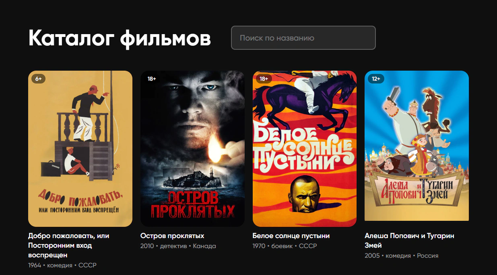

# Тестовый каталог фильмов



## Описание

- Сделан дамп фильмов из рейтинга Кинопоиска [Топ-250](https://www.kinopoisk.ru/lists/movies/top250/) вместе с постерами (GraphQL API).
- Сервер с данными разработан с использованием **чистого JS**, **Node.js**, **Express** и **SQLite**.
- Фронтенд разработан на **Angular 20**.

## Установка

1. Клонировать репозиторий.
2. Установить Node.js.
3. Зайти в ```/packages/server```, выполнить команду ```npm i```, затем ```npm start```.
4. Зайти в ```/packages/client```, выполнить команду ```npm i```, затем ```npm start```.
5. Открыть в браузере ```http://127.0.0.1:40452```.